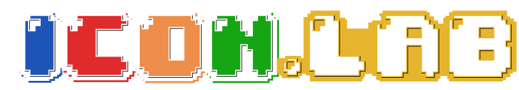

<p align="center">
  
</p>

<h1 align="center">🕹️ ICON.LAB 2026 — Official Website</h1>

<p align="center">
  <strong>Informatics Competition & Innovation Lab</strong><br/>
  <em>"Innovating Technology for Sustainable Society 5.0"</em>
</p>

<p align="center">
  
  
  
  
  
</p>

---

## 📖 Daftar Isi

- [Tentang Proyek](#-tentang-proyek)
- [Tema & Latar Belakang](#-tema--latar-belakang)
- [Fitur Utama Website](#-fitur-utama-website)
- [Cabang Kompetisi](#-cabang-kompetisi)
  - [Game Development](#1--game-development)
  - [Lomba Karya Tulis Ilmiah (LKTI)](#2--lomba-karya-tulis-ilmiah-lkti)
  - [E-Sports (Mobile Legends: Bang Bang)](#3--e-sports-mobile-legends-bang-bang)
  - [Workshop IT](#4--workshop-it)
- [Tech Stack](#-tech-stack)
- [Arsitektur Proyek](#-arsitektur-proyek)
- [Desain & UI/UX](#-desain--uiux)
  - [Sistem Warna](#sistem-warna)
  - [Tipografi](#tipografi)
  - [Animasi & Efek Visual](#animasi--efek-visual)
  - [Komponen UI Kustom](#komponen-ui-kustom)
- [Halaman Website](#-halaman-website)
- [Struktur Folder & File](#-struktur-folder--file)
- [Komponen React](#-komponen-react)
- [Aset Publik](#-aset-publik)
- [Timeline Acara](#-timeline-acara)
- [Paket Sponsorship](#-paket-sponsorship)
- [Media Partner](#-media-partner)
- [FAQ Umum](#-faq-umum)
- [Kontak & Sosial Media](#-kontak--sosial-media)
- [Instalasi & Menjalankan](#-instalasi--menjalankan)
- [Build untuk Produksi](#-build-untuk-produksi)
- [Penyelenggara](#-penyelenggara)
- [Lisensi](#-lisensi)

---

## 🎯 Tentang Proyek

Website resmi **ICONLAB 2026** (Informatics Competition & Innovation Lab) adalah platform informasi dan pendaftaran untuk ajang kompetisi teknologi nasional yang diselenggarakan oleh **Himpunan Mahasiswa Ilmu Komputer (HIMA ILKOM)** Universitas Negeri Semarang (UNNES).

Website ini dibangun dengan desain **Retro Arcade / Pixel Art** yang khas, memberikan pengalaman visual yang unik dan imersif layaknya sedang bermain di mesin arcade klasik.

### Tujuan Website:
- 🎮 Menyediakan informasi lengkap tentang semua cabang kompetisi ICONLAB 2026
- 📋 Menjadi portal pendaftaran peserta melalui integrasi Google Forms
- 📅 Menampilkan timeline dan jadwal acara secara interaktif
- 💰 Menyediakan informasi paket sponsorship untuk calon sponsor & media partner
- ❓ Memberikan jawaban atas pertanyaan umum (FAQ) per kompetisi
- 📞 Menampilkan kontak narahubung untuk setiap cabang kompetisi

---

## 🌍 Tema & Latar Belakang

**Tema:** *"Innovating Technology for Sustainable Society 5.0"*

Tema ini merupakan manifestasi dukungan terhadap pencapaian **17 tujuan global** yang tertuang dalam **Sustainable Development Goals (SDGs)**. Melalui tiga pilar kompetisi utama, ajang ini dirancang untuk:

- 🧠 Memacu kreativitas generasi muda
- 🔍 Menantang ketajaman berpikir kritis
- 🤝 Memperkuat soliditas kerja sama tim
- 💡 Menghasilkan solusi teknologi yang inklusif dan berkelanjutan

---

## ✨ Fitur Utama Website

| Fitur | Deskripsi |
|---|---|
| 🎨 **Retro Arcade Theme** | Desain pixel art lengkap dengan sunburst, 3D floor grid, scanlines, dan elemen arcade |
| ⏳ **Countdown Timer** | Hitung mundur real-time menuju hari pelaksanaan acara |
| 🎞️ **Pixel Page Transition** | Animasi transisi halaman bergaya pixel block (enter/exit) |
| 📱 **Fully Responsive** | Tampilan optimal di mobile, tablet, dan desktop |
| 🎠 **Sponsor Marquee** | Carousel infinite scroll untuk logo sponsor dan media partner |
| 📋 **Event Detail Pages** | Halaman detail per kompetisi dengan timeline, persyaratan, FAQ, dan kontak |
| 🕹️ **Interactive Hero** | Hero section dengan tombol arcade, joystick, dan coin slot interaktif |
| ☁️ **Pixel Clouds** | Animasi awan pixel bergerak ala game Super Mario |
| ⭐ **Star Decorations** | Bintang pixel dan dekorasi Minecraft sebagai elemen background |
| 🏆 **Prize Showcase** | Tampilan reward/hadiah bergaya podium arcade |
| 📖 **FAQ Accordion** | Komponen FAQ interaktif yang bisa diklik (expand/collapse) |
| 🔗 **WhatsApp Integration** | Link langsung ke WhatsApp narahubung setiap kompetisi |
| 🌈 **ColorfulText** | Teks warna-warni neon glow dengan efek shadow bertema arcade |
| 🎯 **Scroll Reveal** | Animasi elemen muncul saat user scroll ke posisi tertentu |

---

## 🏆 Cabang Kompetisi

### 1. 🎮 Game Development

| Item | Detail |
|---|---|
| **Warna Tema** | Merah (`#FF1111`) |
| **Ikon** | Gamepad2 |
| **Target Peserta** | Mahasiswa aktif D3/D4/S1 PTN/PTS se-Indonesia |
| **Ukuran Tim** | 2–3 orang (1 ketua + maks. 2 anggota) dari perguruan tinggi yang sama |
| **Tema Game** | Wajib berkaitan dengan salah satu dari 17 poin SDGs |
| **Game Engine** | Bebas (Unity, Unreal, Godot, Construct, dll), **KECUALI** Roblox Studio |
| **Platform** | Desktop (Windows/Linux), Mobile (Android/iOS), atau Web |
| **Generative AI** | **Dilarang keras** (aset, kode, maupun konten) |
| **Tanggal Final** | 23 Mei 2026 |
| **Link Registrasi** | [Google Forms](https://forms.gle/WKCuZKazMqogQcNZ8) |
| **Narahubung** | Wira (+62 895 7033 78080) |

**Persyaratan:**
1. Mahasiswa aktif (D3/D4/S1) perwakilan PTN/PTS se-Indonesia
2. Tema wajib berkaitan dengan salah satu dari 17 poin SDGs
3. Game engine bebas, KECUALI Roblox Studio atau sejenisnya
4. Dilarang menggunakan Generative AI (Aset/Kode/Konten)
5. Game harus playable (dapat dijalankan) tanpa error fatal
6. Karya bersifat orisinal dan tidak mengandung unsur SARA

**Kriteria Penilaian:**

| Kriteria | Poin | Detail |
|---|---|---|
| Game Design Document | 30 | Kejelasan fitur, fungsi, dan kesesuaian GDD dengan game |
| Game Implementation | 100 | Kesesuaian tema SDGs, kreativitas, visual, sound, dan gameplay |
| Video Demo Game | 30 | Kesesuaian video dengan game dan kualitas presentasi video |
| Final Presentation | 100 | Penguasaan materi presentasi dan kualitas tanya jawab (Q&A) |

**Hadiah:**
- Juara 1-3: Piala + Sertifikat + Uang pembinaan
- Juara Harapan 1-2: E-Sertifikat + Piala

---

### 2. 📝 Lomba Karya Tulis Ilmiah (LKTI)

| Item | Detail |
|---|---|
| **Warna Tema** | Biru (`#00AAFF`) |
| **Ikon** | FileText |
| **Target Peserta** | Mahasiswa aktif D3/D4/S1 PTN/PTS se-Indonesia (WNI) |
| **Ukuran Tim** | 3 orang (1 ketua + 2 anggota) dari instansi yang sama |
| **Pembimbing** | Setiap tim wajib dibimbing oleh satu tenaga pendidik |
| **Maks. Halaman** | 15 halaman inti |
| **Format** | Sesuai kaidah PUEBI |
| **Tanggal Grand Final** | 23 Mei 2026 |
| **Link Registrasi** | [Google Forms](https://forms.gle/4CGJZP4hkvT334iAA) |
| **Narahubung** | Selma (+62 889 8060 2427) |

**Subtema LKTI:**
- Kesejahteraan Sosial & Ekonomi
- Kesehatan & Kualitas Hidup
- Pendidikan Berkualitas & Inklusif
- Lingkungan & Keberlanjutan
- Inovasi Teknologi & Pembangunan Berkelanjutan

**Biaya Pendaftaran:**

| Gelombang | Harga/Tim |
|---|---|
| Early Bird | Rp 55.000 |
| Gelombang 1 | Rp 65.000 |
| Gelombang 2 | Rp 75.000 |

**Kriteria Penilaian:**

| Kriteria | Bobot | Detail |
|---|---|---|
| Naskah Full Paper | 60% | Format penulisan, kreativitas gagasan, kesesuaian topik, data & sumber, analisis-sintesis |
| Presentasi Final | 40% | Pemaparan, sistematika, dan diskusi/tanya jawab dengan juri |

**Hadiah:**
- Juara 1-3: Piala + e-sertifikat + Uang
- Juara Harapan 1-2: Piala + e-sertifikat

---

### 3. ⚔️ E-Sports (Mobile Legends: Bang Bang)

| Item | Detail |
|---|---|
| **Warna Tema** | Hijau (`#00FF00`) |
| **Ikon** | Users |
| **Target Peserta** | Masyarakat umum Kota Semarang |
| **Ukuran Tim** | 5 pemain inti + 1 pemain cadangan |
| **Roster Lock** | Tim yang sudah didaftarkan tidak dapat diubah |
| **Tanggal Final** | 16 Mei 2026 |
| **Lokasi Final** | Gedung D4 FMIPA UNNES |
| **Link Registrasi** | [Google Forms](https://forms.gle/aTEH3d9xt6wJLZL69) |
| **Narahubung** | Damar (+62 822 7986 2622) |

**Biaya Pendaftaran:**

| Gelombang | Harga |
|---|---|
| Early Bird | Rp 40.000 |
| Gelombang 1 | Rp 45.000 |
| Gelombang 2 | Rp 50.000 |

**Sistem Pertandingan:**

| Tahap | Format | Tanggal | Mode |
|---|---|---|---|
| Penyisihan | BO1 (Single Elimination) | 10 Mei 2026 (19.00) | Online |
| Semifinal | BO3 | 16 Mei 2026 (09.30) | Offline |
| Perebutan Juara 3 | BO3 | 16 Mei 2026 (12.45) | Offline |
| Grand Final | BO5 | 16 Mei 2026 (14.00) | Offline |

**Aturan In-Game:**
- Skin: ON | Chat (Team): ON | Chat (All): **OFF**
- Stickers: ON | Radio (All): **OFF** | Recall: ON
- Pause: 1x/match (maks. 3 menit), Final 2x/match (khusus offline)

**Hadiah:**
- Piala + e-Sertifikat + Uang Tunai

---

### 4. 🖥️ Workshop IT

| Item | Detail |
|---|---|
| **Warna Tema** | Orange (`#FF8800`) |
| **Ikon** | Monitor |
| **Status** | ⏳ Coming Soon |
| **Narahubung** | Sulthan (+62 813 6927 4302), Zahra (+62 822 4146 7806) |

> Detail Workshop IT ICONLAB 2026 sedang dalam tahap penyusunan. Informasi selengkapnya akan diumumkan melalui Instagram [@iconlab.ilkom](https://www.instagram.com/iconlab.ilkom/).

---

## 🛠️ Tech Stack

| Teknologi | Versi | Fungsi |
|---|---|---|
| **React** | 19.2.4 | Library utama untuk membangun UI berbasis komponen |
| **Vite** | 8.0.1 | Build tool & dev server yang super cepat |
| **Tailwind CSS** | 4.2.2 | Utility-first CSS framework untuk styling responsif |
| **Framer Motion** | 12.38.0 | Library animasi deklaratif untuk React |
| **Lucide React** | 0.577.0 | Koleksi ikon SVG yang konsisten dan modern |
| **PostCSS** | 8.5.8 | Tool untuk transformasi CSS |
| **Autoprefixer** | 10.4.27 | Plugin PostCSS untuk vendor prefixing otomatis |
| **ESLint** | 9.39.4 | Linter untuk menjaga kualitas dan konsistensi kode |

### Dev Dependencies

| Teknologi | Versi | Fungsi |
|---|---|---|
| **@vitejs/plugin-react** | 6.0.1 | Plugin Vite untuk dukungan React (JSX, Fast Refresh) |
| **eslint-plugin-react-hooks** | 7.0.1 | Aturan ESLint untuk React Hooks |
| **eslint-plugin-react-refresh** | 0.5.2 | Validasi React Refresh boundaries |

---

## 🏗️ Arsitektur Proyek

Website ini dibangun sebagai **Single Page Application (SPA)** dengan sistem routing kustom (tanpa React Router). Navigasi ditangani oleh state `currentRoute` dan `routeParams` di komponen `App`.

```
┌────────────────────────────────────────┐
│              index.html                │
│  ┌──────────────────────────────────┐  │
│  │           main.jsx               │  │
│  │  ┌────────────────────────────┐  │  │
│  │  │        App.jsx             │  │  │
│  │  │  ┌──────────────────────┐  │  │  │
│  │  │  │  Custom Router State │  │  │  │
│  │  │  │  currentRoute +      │  │  │  │
│  │  │  │  routeParams         │  │  │  │
│  │  │  └──────────────────────┘  │  │  │
│  │  │          │                 │  │  │
│  │  │    ┌─────┼──────┬─────┐   │  │  │
│  │  │    ▼     ▼      ▼     ▼   │  │  │
│  │  │  Home  Event  About  Sp.  │  │  │
│  │  │  Page  Detail Page  Page  │  │  │
│  │  └────────────────────────────┘  │  │
│  └──────────────────────────────────┘  │
└────────────────────────────────────────┘
```

### Alur Navigasi:

```
home ──────── / (landing page)
event ─────── /event/{eventId}  (gamedev | lkti | mlbb | workshop)
about ─────── /about
sponsorship ─ /sponsorship
```

Transisi antar halaman menggunakan **PixelTransition** — animasi blok pixel berwarna-warni yang menutupi layar (enter phase) lalu terbuka kembali (exit phase), masing-masing berdurasi ~700ms.

---

## 🎨 Desain & UI/UX

### Sistem Warna

Website menggunakan palet warna bertema **Retro Arcade** dengan kontras tinggi:

| Nama | Hex Code | Penggunaan |
|---|---|---|
| 🟡 Arcade Yellow | `#E8B42B` | Background utama body |
| 🔴 Retro Red | `#FF1111` | Warna aksen utama, tema Game Dev, highlight |
| 🟠 Retro Orange | `#FF8800` | Tombol arcade default, tema Workshop |
| 🟡 Neon Yellow | `#FFDF00` | Badge, highlight CTA, countdown |
| 🟢 Retro Green | `#00FF00` | Tombol CTA "Daftar", tema E-Sports |
| 🔵 Retro Blue | `#00AAFF` | Aksen sekunder, tema LKTI |
| 🔵 Deep Navy | `#030841` | Background gelap (pixel-window, footer) |
| ⬛ Black | `#000000` | Border, shadow, outline |
| ⬜ White | `#FFFFFF` | Teks, border inner, pixel-window-light |

### Tipografi

| Font | Sumber | Penggunaan |
|---|---|---|
| **Press Start 2P** | Google Fonts | Heading, judul, label (`.font-pixel`) |
| **VT323** | Google Fonts | Body text, deskripsi, teks konten (`.font-VT323`) |

### Animasi & Efek Visual

| Animasi | Kelas CSS | Deskripsi |
|---|---|---|
| **Sunburst** | `.bg-sunburst` | Background berputar 360° dengan conic gradient (40s loop) |
| **3D Grid Floor** | `.perspective-floor` | Lantai grid 3D perspektif yang bergerak (ala retro racing) |
| **Dot Grid** | `.bg-dot-grid` | Pola titik-titik halus sebagai overlay background |
| **Checkerboard** | `.bg-checker` | Pola kotak-kotak 45° untuk background FAQ |
| **Marquee Left** | `.animate-marquee-left` | Scroll horizontal kiri infinite (sponsor) |
| **Marquee Right** | `.animate-marquee-right` | Scroll horizontal kanan infinite (media partner) |
| **Float** | `.animate-float` | Naik-turun halus 4s (juga varian fast 2.5s & slow 6s) |
| **Cloud Drift** | `.animate-cloud` | Gerakan awan pixel dari kiri ke kanan |
| **Scanlines** | `.scanlines` | Overlay garis-garis CRT monitor retro |
| **Pixel Transition** | `pixelBlockIn/Out` | Transisi halaman bergaya blok pixel berwarna-warni |
| **Pulse** | Tailwind `animate-pulse` | Kedip-kedip untuk elemen penting |
| **Bounce** | Tailwind `animate-bounce` | Efek bouncing pada coin slot hover |

### Komponen UI Kustom

| Komponen | Kelas CSS | Deskripsi |
|---|---|---|
| **Pixel Window (Dark)** | `.pixel-window` | Container gelap dengan border putih, outline hitam, shadow 3D |
| **Pixel Window (Light)** | `.pixel-window-light` | Container terang dengan border hitam dan shadow 3D |
| **Arcade Button** | `.btn-arcade` | Tombol bergaya arcade dengan efek 3D inset shadow |
|  | `.btn-arcade.red` | Varian merah |
|  | `.btn-arcade.blue` | Varian biru |
|  | `.btn-arcade.yellow` | Varian kuning (teks hitam) |
|  | `.btn-arcade.green` | Varian hijau (teks hitam) |
| **Round Arcade Button** | `.arcade-round-btn` | Tombol bulat seperti tombol arcade fisik |
| **Digital Clock** | `.digital-clock` | Tampilan angka bergaya scoreboard LED |
| **Joystick** | `.joystick-base/stick/ball` | Joystick 3D interaktif pada hero section |

---

## 📄 Halaman Website

### 1. 🏠 Homepage (`home`)

Terdiri dari 5 section besar:

| # | Section | Deskripsi |
|---|---|---|
| 1 | **Hero Section** | Logo ICONLAB, tema, tagline, tombol CTA, countdown timer, elemen arcade interaktif (tombol merah/biru/
